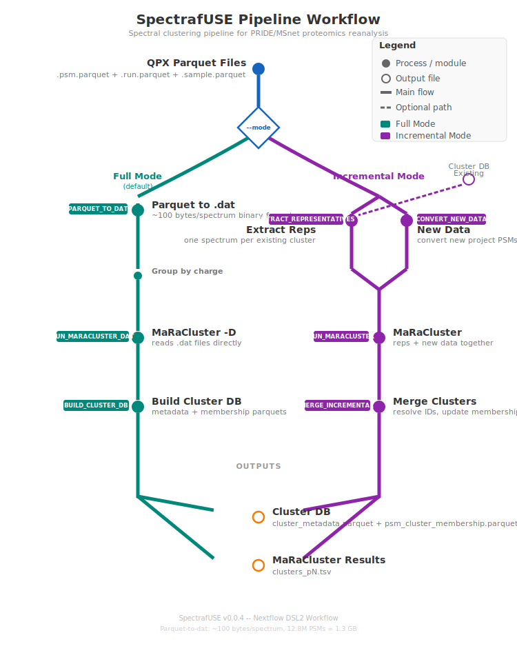

# spectrafuse

Incremental spectral clustering pipeline from [quantms data](https://quantms.org). quantms is a workflow for reanalysis of public proteomics data. quantms not only releases a workflow to the public but also performs reanalysis of public proteomics data in a systematic way for TMT, LFQ, ITRAQ and other DDA methods.

quantms has reanalyzed an extensive number of datasets with almost 1 billion MS/MS (Mass Spectrometry/Mass Spectrometry) MS2 analyzed, comprising nearly 100 million PSMs (Peptide-Spectrum Matches) derived from various tissues, cell lines, and diseases. In light of this vast wealth of data, spectrafuse aims to apply spectral clustering techniques to organize this data and construct spectral libraries.

[spectrafuse](https://github.com/bigbio/spectrafuse) is a Nextflow workflow that performs incremental clustering of quantms data and is based on the tool [MaRaCluster](https://github.com/statisticalbiotechnology/maracluster).

## Workflow Overview



The pipeline converts QPX parquet files directly into MaRaCluster's internal `.dat` binary format (~100 bytes/spectrum), making it feasible to cluster datasets with millions of PSMs on standard hardware.

The pipeline supports three modes:

### Full Mode (default)

Parquet &rarr; `.dat` &rarr; MaRaCluster &rarr; Cluster DB

1. **Parquet to Dat** (`PARQUET_TO_DAT`): Converts PSM parquet files directly to MaRaCluster's binary `.dat` format, optionally filtering by charge state. Replicates MaRaCluster's internal binning algorithm (`bin = floor(mz / 1.000508 + 0.32)`, top-40 peaks).

2. **MaRaCluster** (`RUN_MARACLUSTER_DAT`): Clusters spectra using the `-D` flag to read pre-existing `.dat` files, skipping MaRaCluster's own file conversion step.

3. **Build Cluster DB** (`BUILD_CLUSTER_DB`): Generates `cluster_metadata.parquet` and `psm_cluster_membership.parquet` from MaRaCluster's clustering output and the scan-title mappings produced during dat conversion.

### Incremental Mode

Adds new data to an existing cluster DB without re-clustering everything.

1. **Extract Representatives** (`EXTRACT_REPRESENTATIVES`): Reads cluster metadata and writes one consensus spectrum per existing cluster.

2. **Convert New Data**: Converts new project PSMs to charge-specific spectrum files.

3. **MaRaCluster** (`RUN_MARACLUSTER`): Clusters representatives + new data together. Representatives that land in the same new cluster as new spectra link those spectra to the existing cluster.

4. **Merge Clusters** (`MERGE_INCREMENTAL`): Resolves cluster IDs (representative &rarr; original cluster mapping, multi-representative merges, fresh UUIDs for new-only clusters) and updates the cluster DB.

### Key Features

- **Compact binary format**: Parquet-to-dat conversion produces ~1.3 GB for 12.8M PSMs
- **Incremental clustering**: Add new datasets without re-clustering existing data
- **Parallel processing**: Projects and charge partitions are processed in parallel
- **Partitioned by metadata**: Clustering is performed separately for each species/instrument/charge combination
- **Consensus spectra**: Multiple strategies (best, bin, most, average) for generating consensus spectra from clusters

## Input Requirements

The workflow requires:

1. **QPX Parquet files**: A directory containing one or more project subdirectories. Each project directory should contain the QPX file set:

   | File | Purpose |
   |------|---------|
   | `{id}.psm.parquet` | PSM spectra (mz_array, intensity_array, charge, sequence, etc.) |
   | `{id}.run.parquet` | Run metadata (run_file_name, instrument, samples, enzymes) |
   | `{id}.sample.parquet` | Sample metadata (organism, organism_part) |

2. **Directory structure**:
   ```
   parquet_dir/
   ├── PXD004732/
   │   ├── PXD004732.psm.parquet
   │   ├── PXD004732.run.parquet
   │   └── PXD004732.sample.parquet
   ├── PXD004733/
   │   ├── PXD004733.psm.parquet
   │   ├── PXD004733.run.parquet
   │   └── PXD004733.sample.parquet
   └── ...
   ```

## Installation

### Prerequisites

- [Nextflow](https://www.nextflow.io/) >= 23.04.0
- Docker, Singularity, Podman, or another container engine
- Java 11 or later (for Nextflow)

### Install Nextflow

```bash
curl -s https://get.nextflow.io | bash
```

### Clone the Repository

```bash
git clone https://github.com/bigbio/spectrafuse.git
cd spectrafuse
```

## Usage

### Full Mode (default)

```bash
nextflow run main.nf \
    --parquet_dir /path/to/projects \
    --default_species "Homo sapiens" \
    --default_instrument "Q Exactive HF" \
    -profile docker
```

### Incremental Mode

```bash
nextflow run main.nf \
    --parquet_dir /path/to/new_projects \
    --mode incremental \
    --existing_cluster_db /path/to/cluster_db \
    -profile docker
```

### Resume a Previous Run

```bash
nextflow run main.nf \
    --parquet_dir /path/to/projects \
    -profile docker \
    -resume
```

### Test Run

```bash
nextflow run main.nf -profile test,docker
```

## Parameters

### Required Parameters

| Parameter | Description | Example |
|-----------|-------------|---------|
| `--parquet_dir` | Directory containing project subdirectories with QPX parquet files | `/data/projects` |

### Pipeline Mode Parameters

| Parameter | Description | Default |
|-----------|-------------|---------|
| `--mode` | Pipeline mode: `full` or `incremental` | `full` |
| `--existing_cluster_db` | Path to existing cluster DB (required for incremental mode) | `null` |
| `--default_species` | Species label for cluster DB metadata | `null` |
| `--default_instrument` | Instrument label for cluster DB metadata | `null` |
| `--skip_instrument` | Cluster all instruments together (no instrument partitioning) | `false` |

### MaRaCluster Parameters

| Parameter | Description | Default |
|-----------|-------------|---------|
| `--maracluster_pvalue_threshold` | Log10(p-value) threshold for MaRaCluster clustering (e.g., -10.0 = p-value 1e-10) | `-10.0` |
| `--maracluster_precursor_tolerance` | Precursor m/z tolerance in ppm for MaRaCluster | `20.0` |
| `--cluster_threshold` | P-value threshold for MaRaCluster output file naming (e.g., `*_p30.tsv`) | `30` |
| `--maracluster_verbose` | Enable verbose output from MaRaCluster | `false` |

### Consensus Strategy Parameters

| Parameter | Description | Default | Options |
|-----------|-------------|---------|---------|
| `--strategytype` | Consensus spectrum generation method | `best` | `best`, `most`, `bin`, `average` |

**For `most` method (Most Similar Spectrum):**
| Parameter | Description | Default |
|-----------|-------------|---------|
| `--sim` | Similarity measure method | `dot` |
| `--fragment_mz_tolerance` | Fragment m/z tolerance for spectrum comparison | `0.02` |

**For `bin` method (Binning Strategy):**
| Parameter | Description | Default |
|-----------|-------------|---------|
| `--min_mz` | Minimum m/z value to consider | `100` |
| `--max_mz` | Maximum m/z value to consider | `2000` |
| `--bin_size` | Bin size in m/z units | `0.02` |
| `--peak_quorum` | Relative number of spectra in a cluster that need to contain a peak for it to be included (0.0-1.0) | `0.25` |
| `--edge_case_threshold` | Threshold for correcting m/z edge cases during binning (0.0-1.0) | `0.5` |

**For `average` method (Average Spectrum):**
| Parameter | Description | Default |
|-----------|-------------|---------|
| `--diff_thresh` | Minimum distance between MS/MS peak clusters | `0.01` |
| `--dyn_range` | Dynamic range to apply to output spectra | `1000` |
| `--min_fraction` | Minimum fraction of cluster spectra where MS/MS peak is present (0.0-1.0) | `0.5` |
| `--pepmass` | Peptide mass calculation method | `lower_median` |
| `--msms_avg` | MS/MS averaging method | `weighted` |

### Output Parameters

| Parameter | Description | Default |
|-----------|-------------|---------|
| `--outdir` | Output directory for results | `./results` |
| `--publish_dir_mode` | Publish directory mode | `copy` |

### Resource Limits

| Parameter | Description | Default |
|-----------|-------------|---------|
| `--max_memory` | Maximum memory per process | `128.GB` |
| `--max_cpus` | Maximum CPUs per process | `16` |
| `--max_time` | Maximum time per process | `240.h` |

## Output Structure

### Full Mode

```
results/
├── cluster_db/                     # Cluster database (per charge partition)
│   └── partition__charge{N}/
│       ├── cluster_metadata.parquet       # One row per cluster (consensus spectrum, purity, member count)
│       └── psm_cluster_membership.parquet # One row per PSM (USI, cluster_id, sequence, q-value)
├── maracluster_results/            # MaRaCluster raw output
│   └── clusters_p30.tsv
└── pipeline_info/                  # Pipeline execution metadata
    ├── execution_report.html
    ├── execution_timeline.html
    ├── execution_trace.txt
    └── pipeline_dag.html
```

### Incremental Mode

Same structure as full mode, with updated cluster metadata and membership parquets that include both existing and new PSMs.

## Profiles

### Container Engine Profiles

- `docker` - Use Docker containers
- `singularity` - Use Singularity containers
- `podman` - Use Podman containers
- `apptainer` - Use Apptainer containers
- `charliecloud` - Use Charliecloud containers
- `shifter` - Use Shifter containers

### Platform Profiles

- `arm64` - For ARM64 architecture (e.g., Apple Silicon)
- `emulate_amd64` - Emulate AMD64 on ARM64 hosts

### Other Profiles

- `test` - Use test configuration with minimal dataset
- `debug` - Enable debug mode with detailed logging
- `gpu` - Enable GPU support
- `wave` - Use Wave containers

### Example Profile Combinations

```bash
# Docker on x86_64
nextflow run main.nf -profile docker

# Docker on Apple Silicon (ARM64)
nextflow run main.nf -profile docker,arm64

# Singularity on HPC cluster
nextflow run main.nf -profile singularity

# Test run with Docker
nextflow run main.nf -profile test,docker
```

## Consensus Spectrum Strategies

The workflow supports four different strategies for generating consensus spectra from clusters:

1. **`best`** (default): Selects the spectrum with the best quality metric (lowest posterior error probability or global q-value) as the consensus spectrum.

2. **`most`**: Selects the spectrum most similar to all other spectra in the cluster using similarity measures (e.g., dot product).

3. **`bin`**: Uses binning-based approach where peaks are binned by m/z, and peaks present in a quorum of spectra are included in the consensus.

4. **`average`**: Computes an averaged spectrum from all spectra in the cluster, with configurable peak alignment and filtering.

Choose the strategy based on your use case:
- **`best`**: Fast, good for high-quality data
- **`most`**: Good for finding representative spectra
- **`bin`**: Good for noisy data, robust peak detection
- **`average`**: Good for high-quality clusters, smooth spectra

## Troubleshooting

### Common Issues

1. **"Please provide a folder containing the files that will be clustered (--parquet_dir)"**
   - Solution: Ensure you provide the `--parquet_dir` parameter with a valid path.

2. **Container platform mismatch (ARM64 vs AMD64)**
   - Solution: Use `-profile docker,arm64` on Apple Silicon, or `-profile docker,emulate_amd64` to emulate AMD64.

3. **Memory errors during clustering**
   - Solution: Increase `--max_memory` or reduce the number of parallel processes.

4. **Missing QPX parquet files**
   - Solution: Ensure each project directory contains `.psm.parquet`, `.run.parquet`, and `.sample.parquet` files.

### Getting Help

- Check the [Nextflow log](https://www.nextflow.io/docs/latest/tracing.html) for detailed error messages
- Review the execution report in `results/pipeline_info/execution_report.html`
- Open an issue on [GitHub](https://github.com/bigbio/spectrafuse/issues)

## Citation

If you use spectrafuse in your research, please cite:

- The spectrafuse workflow (when published)
- [MaRaCluster](https://github.com/statisticalbiotechnology/maracluster) for the clustering algorithm
- [quantms](https://quantms.org) for the reanalysis workflow

## License

This workflow is licensed under the MIT License. See the LICENSE file for details.

## Contributing

Contributions are welcome! Please see the [Contributing Guidelines](CONTRIBUTING.md) for more information.

## Acknowledgments

- [MaRaCluster](https://github.com/statisticalbiotechnology/maracluster) for the clustering algorithm
- [quantms](https://quantms.org) for the proteomics reanalysis workflow
- [Nextflow](https://www.nextflow.io/) for the workflow management system
- [nf-core](https://nf-co.re/) for workflow best practices and infrastructure
