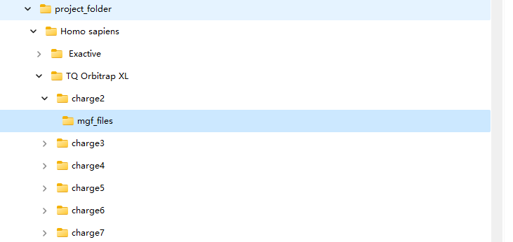
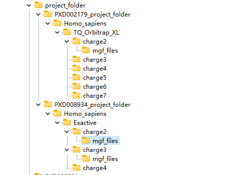
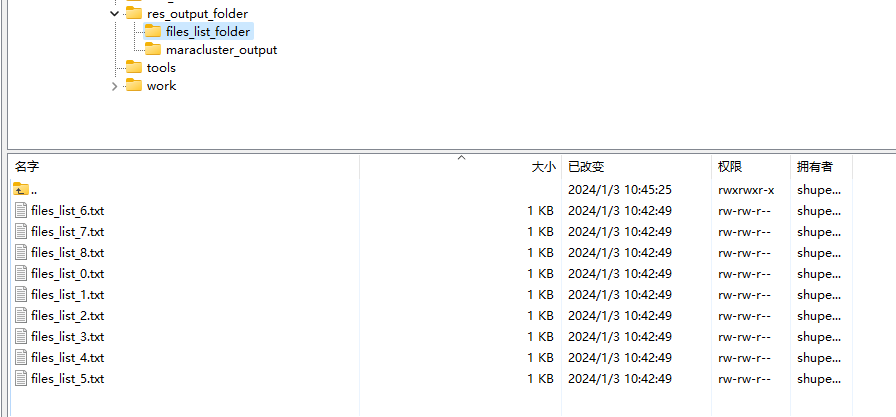
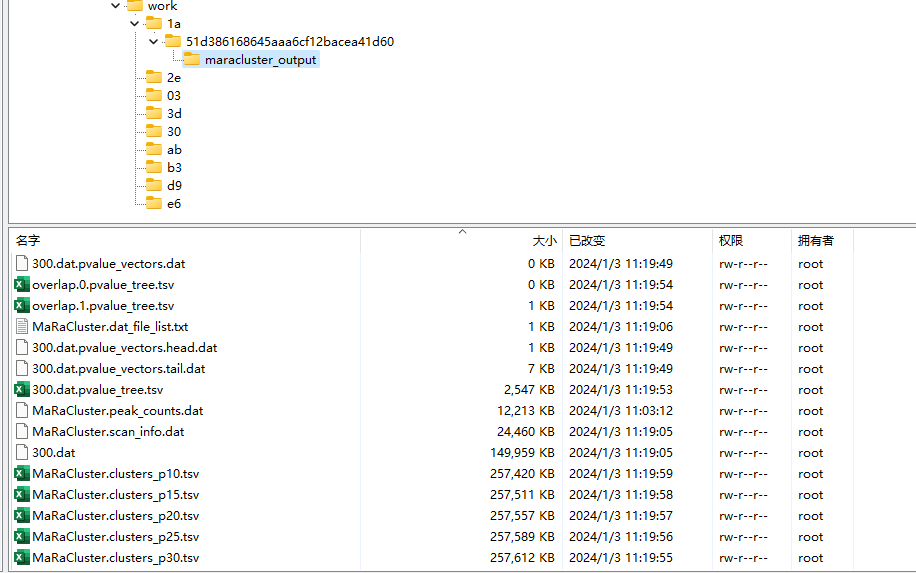

## 1.python script

### 1.1 parquet files convert mgf files

1. `mgf_converter.py`

```python
import os
import pyarrow.parquet as pq
import sys
import pandas as pd


def read_sdrf(sdrf_folder: str) -> dict:
    sdrf_df = pd.read_csv(sdrf_folder, sep='\t')
    sdrf_feature_df = pd.DataFrame()
    try:
        sdrf_feature_df = sdrf_df.loc[:, ['comment[data file]', 'characteristics[organism]', 'comment[instrument]']]
    except KeyError:
        print(f'{sdrf_folder} file has some format error, please check the col index format.')

    sdrf_feature_df['comment[data file]'] = sdrf_feature_df['comment[data file]'].apply(lambda x: x.split('.')[0])
    sdrf_feature_df['comment[instrument]'] = sdrf_feature_df[
        'comment[instrument]'].apply(lambda x: x.split(';')[0][4:])
    sdrf_feature_df['organism_instrument'] = sdrf_feature_df[
        ['characteristics[organism]', 'comment[instrument]']].apply(lambda x: list(x), axis=1)
    sample_info_dict = sdrf_feature_df.set_index('comment[data file]')['organism_instrument'].to_dict()
    return sample_info_dict


def mk_mgf(mgf_file_path: str, spectrum_str: str) -> None:
    dirname = os.path.dirname(mgf_file_path)
    if not os.path.exists(dirname):
        os.makedirs(dirname)

    with open(mgf_file_path, 'a') as f:
        f.write(spectrum_str)


def mgf_converter(project_folder: str, sdrf_folder: str, output_folder: str) -> None:
    os.chdir(project_folder)
    sample_info_dict = read_sdrf(sdrf_folder)
    # basename = os.path.basename(project_folder)
    basename = os.path.basename(sdrf_folder).split('.')[0]
    # current_file = None
    # current_file_path = None

    for folder in os.listdir():
        if folder.startswith('parquet'):
            for parquet_file in os.listdir(folder):
                parquet_file_path = os.path.join(folder, parquet_file)
                print(parquet_file_path)
                parquet_file_obj = pq.ParquetFile(parquet_file_path)

                # for row_group
                for i in range(parquet_file_obj.num_row_groups):
                    row_group = parquet_file_obj.read_row_group(i)
                    row_group = row_group.to_pandas()
                    write_count = 0  # record write count
                    file_index = 0  # record file index
                    # for one row
                    for _, row in row_group.iterrows():
                        output_lines = (
                            f'BEGIN IONS\n'
                            f'TITLE=id=mzspec:{basename}:'
                            f'{row["reference_file_name"]}:scan:{str(row["scan_number"])},'
                            f'sequence:{row["peptidoform"]},'
                            f'q_value:{str(row["protein_global_qvalue"])}\n'
                            f'PEPMASS={str(row["exp_mass_to_charge"])}\n'
                            f'CHARGE={str(row["charge"])}+\n'
                        )
                        mz_intensity_str = ""
                        for mz, intensity in zip(row['mz_array'], row['intensity_array']):
                            mz_intensity_str += f'{str(mz)} {str(intensity)}\n'

                        output_lines = f'{output_lines}{mz_intensity_str}END IONS\n'
                        print(output_lines)
                        base_folder = '/'.join(sample_info_dict.get(row['reference_file_name']))

                        if write_count % 1000000 == 0: # if the spectrum's num over 1000000, the file index+1
                            file_index += 1

                        mgf_folder = (f'{output_folder}/{base_folder}/charge{str(row["charge"])}/mgf_files/'
                                      f'{basename}-charge{str(row["charge"])}_{file_index}.mgf')
                        mk_mgf(mgf_folder, output_lines)

                        write_count += 1


if __name__ == '__main__':
    # pxd_folder = 'G:\\graduation_project\\generate-spectrum-library\\PXD008934\\mztab'
    # output_folder = 'G:\\graduation_project\\generate-spectrum-library\\project_folder'
    # sdrf_file = pxd_folder + '\\PXD008934.sdrf.tsv'
    
    pxd_folder = sys.argv[1]
    sdrf_file = sys.argv[2]
    output_folder = sys.argv[3]
    mgf_converter(pxd_folder, sdrf_file, output_folder)

```

**params**:

- `PXD_folder:` the project parquet files' folder
- `sdrf_file:` the project sdrf files folder url
- `output_folder:` the output folder's construction:



**usage**: 

```shell
python mgf_converter.py 'G:\\graduation_project\\generate-spectrum-library\\PXD008934\\mztab'  'G:\\graduation_project\\generate-spectrum-library\\PXD008934\\mztab\\PXD008934.sdrf.tsv' 'G:\\graduation_project\\generate-spectrum-library\\project_folder'
```

### 1.2 Output the paths of clustered MGF files to a specified text file.

`generate_files_list.py`

```python
import os
import sys


def find_mgf_files(folder):

    mgf_list = []
    for root, _, files in os.walk(folder):
        if any(file.endswith('.mgf') for file in files):
            res = [root+os.sep+i for i in files]
            mgf_list.append(res)

    return mgf_list


def generate_res_folder(folder, output_base_dir):
    mgf_list = find_mgf_files(folder)
    for i in range(0, len(mgf_list)):
        file_list_str = '\n'.join(mgf_list[i])
        print("next: ")
        print(file_list_str)
        output_files = f"{output_base_dir}{os.sep}files_list_{i}.txt"
        with open(output_files,"w") as file:
            file.write(file_list_str)
    print("All task has completed, please check you folder!")

if __name__ == "__main__":
    
    folder = sys.argv[1]
    output_base_dir = sys.argv[2]

    # folder = r"C:\Users\ASUS\Desktop\generate_files_list_folder"
    # output_base_dir = r"C:\Users\ASUS\Desktop\generate_files_list_folder\files_list_dir"

    generate_res_folder(folder, output_base_dir)
    

```

**params**:

- `folder:`项目文件结构



- `output_base_dir:` 你会得到聚类文件列表的txt在这个目录中：



**usage**:

```shell
python pyscript/generate_files_list.py /mnt/nfs/shupeng/generate-spectrum-library/project_folder /mnt/nfs/shupeng/generate-spectrum-library/res_output_folder/files_list_folder/

```

## 2.NextFlow

### 2.1 Maracluster

To run , a flat text file with the absolute/relative path to each of the ms2 spectrum files (one per line) is needed. (if you use **CLI**, like this)

```shell
maracluster batch -b files.txt
```


`run_maracluster.nf:`

```shell
#!/usr/bin/env 
nextflow.enable.dsl=2

params.files_list_folder = "./"
params.maracluster_output = "./"

process runMaRaCluster {

    container 'biocontainers/maracluster:1.02.1_cv1'
    publishDir "${params.maracluster_output}", mode: 'copy', overwrite: true

    input:
    path fileInput 

    output:
    path "maracluster_output/*.tsv", emit: maracluster_results

    script:
    """
    maracluster batch -b "${fileInput}" -t -10
    """
}

workflow {
      file_list = Channel.fromPath("${params.files_list_folder}/files_list_*.txt")
      file_list.view()
      runMaRaCluster(file_list)
}
```

**usage**: 

```shell
nextflow run run_maracluster.nf --files_list_folder /mnt/nfs/shupeng/generate-spectrum-library/res_output_folder/files_list_folder  --maracluster_output /mnt/nfs/shupeng/generate-spectrum-library/res_output_folder/ -with-docker biocontainers/maracluster:1.02.1_cv1

```


- The directory containing the text files(**params**:`files_list_folder`) generated by `generate_files_list.py` will be passed into the workflow through a channel using `Channel.fromPath("${params.files_list_folder}/files_list_*.txt")` in Nextflow.

   Subsequently, the script `maracluster batch -b "${fileInput}" -t -10` will be employed to obtain clustering results using MaraCluster, where "${fileInput}" represents the path to each individual text file in the workflow.

- In nextflow work directoty:




